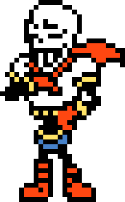

# ¡Hola, soy Gabriel Rueda!

  

 

  

 

  

---

### Sobre mí

Soy un **Desarrollador Fullstack** de 25 años radicado en la CDMX, con un fuerte enfoque en construir ecosistemas web de alto rendimiento y arquitectura escalable. Me apasiona crear interfaces intuitivas respaldadas por sistemas robustos y eficientes.

- **Formación:** Licenciado en Ciencias de la Informática (UPIICSA - IPN).
- **Puesto Actual:** Desarrollador Fullstack en **Echopoint**, empresa de consultoría de TI.
- **Proyectos Actuales:** Diseño y desarrollo integral de un broker financiero, una landing page corporativa optimizada para conversión, y un sistema CRM a medida para la gestión interna de datos en tiempo real.
- **Enfoque técnico:** Implementación de arquitecturas SSG/SSR con Astro, gestión de infraestructura escalable en AWS y optimización avanzada de caché con Cloudflare. Integración y desarrollo sobre CMS empresariales como **Arc XP**.
- **Filosofía:** Código limpio, mantenibilidad y rendimiento como prioridad absoluta.

---

### Tech Stack y Habilidades

**Frontend & Frameworks**

  
  
  
  
  
  
  
  
  

 

**Backend, Data Management & CMS**

  
  
  
  
  
  
  
  

 

**Infraestructura, Cloud & Herramientas**

  
  
  
  
  
  
  

---

### Mis Estadísticas en GitHub

  
  
  

